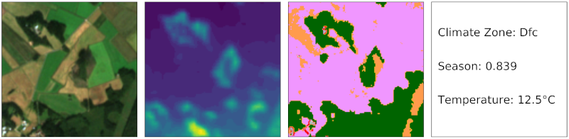

# **ben-ge**: BigEarthNet Extended with Geographical and Environmental Data

---

**ben-ge** is a multimodal dataset for Earth observation that serves as an extension to the [BigEarthNet](https://bigearth.net/) dataset. The latter compiles Sentinel-1 and Sentinel-2 observations for 590,326 locations throughout Europe. **ben-ge** complements this dataset by providing additional data for each of these observations:
* elevation data extracted from the Copernicus Digital Elevation Model GLO-30;
* land-use/land-cover data extracted from ESA Worldcover;
* environmental data concurrent with the Sentinel-1/2 observations from the ERA-5 
* climate zone information extracted from Beck et al. 2018;
global reanalysis;
* a seasonal encoding.

More details on the individual data modalities are provided below in the corresponding section and in our **ben-ge** paper:

    M. Mommert, N. Kesseli, J. Hanna, L. Scheibenreif, D. Borth, B. Demir, "ben-ge: Extending BigEarthNet with Geographical and Environmental Data", IEEE International Geoscience and Remote Sensing Symposium, Pasadena, USA, 2023. 

# Motivation

The motivation behind **ben-ge** is to provide to the community a dataset that contains a wide range of different data modalities for Earth observation applications. **ben-ge** can be used to train and pretrain models on a large dataset and to experiment with concepts such as data fusion, multi-task learning and self-supervised learning, as well as different combinations of input data. 

All external data sources used in creating **ben-ge** are freely accessible and public, enabling researchers to generate the same data modalities for their own datasets. 

# Data Download

**ben-ge** data are hosted by [zenodo](https://zenodo.org/), from where the different data modalities can be downloaded. In addition to the full dataset, we also provide a small-scale version for implementing code and quick experiments.

## Full Dataset

The full **ben-ge** dataset contains multimodal data for 590,326 patches. 

The dataset is provided in a modular fashion so that users can pick the data modalities they are interested in:
* **Sentinel-2**: multiband imagery is available through the original BigEarthNet dataset, please refer to the [BigEarthNet download website](https://bigearth.net/#downloads) for the corresponding link.
* **Sentinel-1** synthetic aperture radar (SAR) polarization data is available through the original BigEarthNet dataset, please refer to the [BigEarthNet download website](https://bigearth.net/#downloads) for the corresponding link.
* **Digital Elevation Model** data are available for download [here](https://zenodo.org/record/8129350) [2.5 GB packed]
* **Land-use/Land-cover Data** are available for download [here](https://zenodo.org/record/8129666) [487 MB packed]
* **Environmental Data** are available for download [here](https://zenodo.org/record/8129412) [18 MB packed]
* **Climate Zone Data** are included in the ben-ge meta data file that is available for download [here](https://github.com/HSG-AIML/ben-ge/data/ben-ge_meta.csv) (87 MB)  
* **Seasonal Encodings** are included in the ben-ge meta data file that is available for download [here](https://github.com/HSG-AIML/ben-ge/data/ben-ge_meta.csv) (87 MB)  

Once unpacked the entire **ben-ge** dataset (including BigEarthNet Sentinel-1/2 data) amounts to 191 GB. 

### Splits

We provide different types of splits for **ben-ge**. We provide different subsets of the full dataset for applications that do not require the full size of the dataset. Each subset contains a certain percentage of the full dataset:

| Identifier    |   Percentage |  Sample Size | Index File Link|
|---------------|:------------:|:------------:|:------------:|
| ben-ge-0.2    |      20%     |   118k       |  tbd
| ben-ge-0.4    |      40%     |   236k       |  tbd
| ben-ge-0.6    |      60%     |   354k       |  tbd
| ben-ge-0.8    |      80%     |   472k       |  tbd

The splits are defined through **index files** that contain the `patch_id` of each patch of the corresponding subset. Please note that subsets were drawn randomly, but care was taken to build them in such a way that smaller subsets are entirely contained in all larger subsets.  **Index files will be made available soon**

Finally, each subset comes with a fixed **train/validation/test** split (80/10/10). Corresponding index files can be downloaded through the links provided in the table above (in the case of **ben-ge-8k**, corresponding index files are provided in the `splits/` directory of the download.

## **ben-ge-8k**: A small-scale version of **ben-ge**

The idea behind **ben-ge-8k** is to provide a small-scale version of **ben-ge** to implement code and test ideas quickly. The advantage of **ben-ge-8k** is that all modalities (including Sentinel-1 and Sentinel-2 from BigEarthNet and corresponding label files) are contained in a single archive file that can be downloaded [here](https://zenodo.org/record/8121208). Once unpacked, **ben-ge-8k** requires 4.2 GB of space. 

# Code and Pretrained Models

We provide Python and Pytorch code elements and pretrained models to make efficient use of this dataset for Deep Learning applications. 

## Code

Code for accessing and using **ben-ge** will be made available soon.

## Pretrained Models

Different model implementations pretrained with **ben-ge** will be made available soon.

# Data Modalities and Products

In the following, we describe the different data modalities included in all detail. For a detailed discussion of the geographical distribution of the locations, as well as Sentinel-1 and Sentinel-2 patches, we refer to the [BigEarthNet](https://bigearth.net/) documentation and publications.

## Meta Data

Relevant meta data for the **ben-ge** dataset are compiled in the file `ben-ge_meta.csv` (`ben-ge-8k_meta.csv` for **ben-ge-8k**). This file is included in most **ben-ge** data downloads and is separately available for download [here](https://github.com/HSG-AIML/ben-ge/data/ben-ge_meta.csv). 

This file contains the following data for each patch:
* `patch_id`: the Sentinel-2 patch id, which plays a central role for cross-referencing different data modalities for individual patches;
* `patch_id_s1`: the Sentinel-1 patch id for this specific patch;
* `timestamp_s2`: the timestamp for the Sentinel-2 observation;
* `timestamp_s1`: the timestamp for the Sentinel-1 observation;
* `season_s2`: the seasonal encoding (see below) for the time of the Sentinel-2 observation;
* `season_s1`: the seasonal encoding (see below) for the time of the Sentinel-1 observation;
* `lon`: longitude (WGS-84) of the center of the patch [degrees];
* `lat`: latitude (WGS-84) of the center of the patch [degrees].

## Digital Elevation Model (Copernicus DEM GLO-30)

Topographic maps are generated based on the global [Copernicus Digital Elevation Model (GLO-30)](https://spacedata.copernicus.eu/collections/copernicus-digital-elevation-model). Relevant GLO-30 map tiles from the 2021 data release were downloaded through [AWS](https://registry.opendata.aws/copernicus-dem/), reprojected into the coordinate frame of the corresponding Sentinel-1/2 patches and interpolated with bilinear resampling to 10 m resolution on the ground. 

Elevation data are provided in a separate `geotiff` file for each patch. The naming convention for these files uses the Sentinel-2 `patch_id` to which we append `_dem.tif`. Each file contains a single band with 16-bit integer values that refer to the elevation of that pixel over sea level.

## Land-use/Land-cover Data (ESA WorldCover)

Land-use/land-cover map tiles matching the Sentinel-1/2 patches were extracted from [ESA WorldCover](https://esa-worldcover.org). Relevant tiles were downloaded and reprojected into the coordinate frame of the corresponding Sentinel-1/2 patches. WorldCover data are available both as maps and as class fractions that are aggregated over all pixels of each patch. 

Land-use/land-cover map data are provided in a separate `geotiff` file for each patch. The naming convention for these files uses the Sentinel-2 `patch_id` to which we append `_esaworldcover.tif`. Each file contains a single band with 8-bit integer values that map to land-use/land-cover definitions provided by the [ESA WorldCover Product User Manual](https://esa-worldcover.s3.eu-central-1.amazonaws.com/v200/2021/docs/WorldCover_PUM_V2.0.pdf) (page 15).

## Climate Zone Data (Beck et al. 2018)

Patch-based climate zone classifications, based on the Köppen-Geiger scheme, were extracted from [Beck et al. (2018)](https://www.nature.com/articles/sdata2018214), utilizing their present-day 1-km resolution map. Due to geographical focus of BigEarthNet on Europe, only 11 out of 27 different classes are present in this dataset. Please note that patches that are fully covered by surface water have no climate zone class assigned to them (class label equals zero in this case).

Climate zones are stored in the file `ben-ge_climatezones.csv`, which contains the climate zone in column `climatezone` for each Sentinel-2 `patch_id`. Labels are encoded as discrete integer values that follow the schema introduced by Beck et al. 2018 in their `legend.txt` file that is included [here](https://doi.org/10.6084/m9.figshare.6396959).

## Environmental Data (ERA-5)

Weather data at the time of observation (temperature at 2 m
above the ground, relative humidity, wind vectors at 10 m
above the ground) are extracted from the [ERA-5 global re-
analysis](https://cds.climate.copernicus.eu/cdsapp#!/dataset/reanalysis-era5-pressure-levels) for the pressure level at the mean elevation of
the observed scene and the time of observation (separately queried for
Sentinel-1/2 observations).

Environmental data are available in the file `ben-ge_era-5.csv`. For each patch, identified through the Sentinel-2 `patch_id` or the corresponding Sentinel-1 patch id `patch_id_s1`, the file contains the following parameters:
* `atmpressure_level`: atmospheric pressure level at which parameters have been queried [mbar]
* `temperature_s2`: temperature 2m above ground at the time of the Sentinel-2 observation [K]
* `temperature_s1`: temperature 2m above ground at the time of the Sentinel-1 observation [K]
* `wind-u_s2`:  eastward component of the wind, at a height of 10 meters above the surface of the Earth at the time of the Sentinel-2 observation [m/s]
* `wind-u_s1`:  eastward component of the wind, at a height of 10 meters above the surface of the Earth at the time of the Sentinel-1 observation [m/s]
* `wind-v_s2`: northward component of the wind, at a height of 10 meters above the surface of the Earth at the time of the Sentinel-2 observation [m/s]
* `wind-v_s1`: northward component of the wind, at a height of 10 meters above the surface of the Earth at the time of the Sentinel-2 observation [m/s]
* `relhumidity_s2`: relative humidity at the time of the Sentinel-2 observation [%]
* `relhumidity_s1`: relative humidity at the time of the Sentinel-1 observation [%]

as extracted from the [ERA-5 global reanalysis](https://cds.climate.copernicus.eu/cdsapp#!/dataset/reanalysis-era5-pressure-levels) for the patch location. Please see the corresponding documentation for details.

## Seasonal Encoding

To capture the season at the time of observation, we apply a non-linear encoding that scale the date of the observation into the interval [0, 1], referring to [winter, summer] solstice. For any given date, we derive the fractional year and shift it by 9 days such that 21 June has the fractional year 0.5 and 22 December has the fractional year 0 or 1. To account for this ambiguity and the periodicity of the seasons, we modulate the fractional year with a sine function such that 21 June leads to a seasonal encoding of 1 and 22 December leads to a seasonal encoding of 0.

Seasonal encodings are provided by the column `season` in the `ben-ge_meta.csv` file (this file is contained in most **ben-ge** data downloads and is separately contained in this repository; please see the documentation for this file for more information on its content). Season values cover the interval [0,1] as a continuous variable where 1 refers to summer solstice and 0 refers to winter solstice. 

# Citing **ben-ge**

If you are using **ben-ge** or either of its derivatives, please make sure to cite the following publications where appropriate:

* if you use either of the **ben-ge**-specific data modalities:

      M. Mommert, N. Kesseli, J. Hanna, L. Scheibenreif, D. Borth, B. Demir, "ben-ge: Extending BigEarthNet with Geographical and Environmental Data", IEEE International Geoscience and Remote Sensing Symposium, Pasadena, USA, 2023. 

* if you use Sentinel-2 data:
      
      G. Sumbul, M. Charfuelan, B. Demir, V. Markl, "BigEarthNet: A Large-Scale Benchmark Archive for Remote Sensing Image Understanding", IEEE International Geoscience and Remote Sensing Symposium, pp. 5901-5904, Yokohama, Japan, 2019.

* if you use Sentinel-1 data: 
     
      G. Sumbul, A. d. Wall, T. Kreuziger, F. Marcelino, H. Costa, P. Benevides, M. Caetano, B. Demir, V. Markl, "BigEarthNet-MM: A Large Scale Multi-Modal Multi-Label Benchmark Archive for Remote Sensing Image Classification and Retrieval", IEEE Geoscience and Remote Sensing Magazine, 2021, doi: 10.1109/MGRS.2021.3089174.

